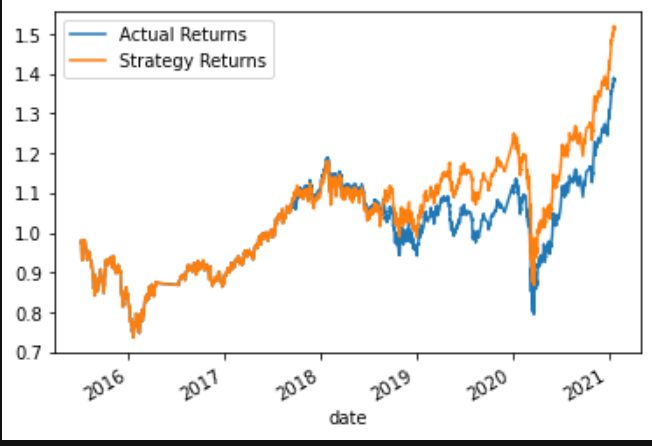
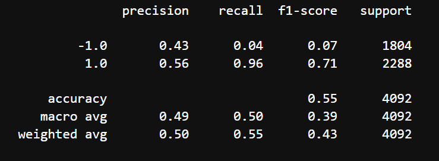
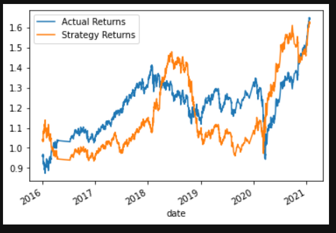
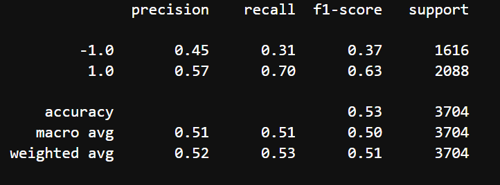
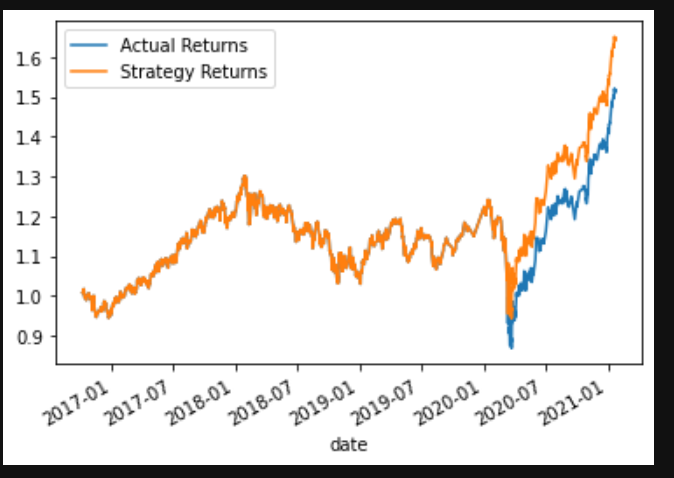
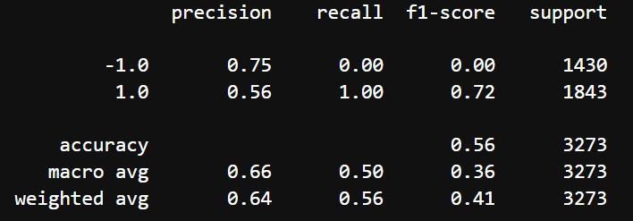
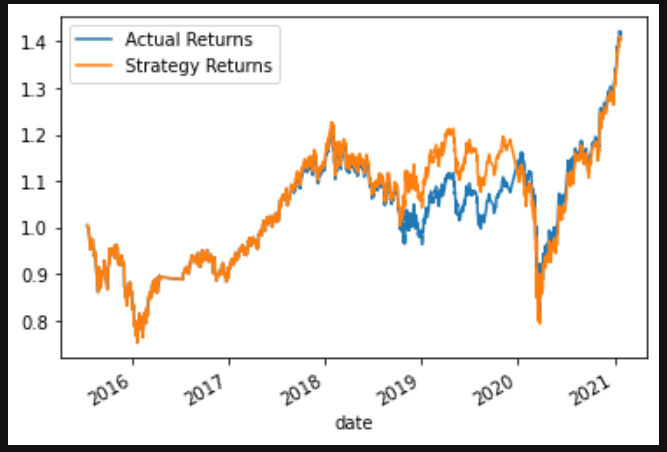
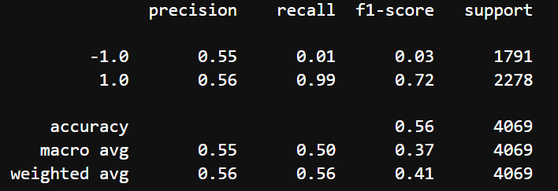
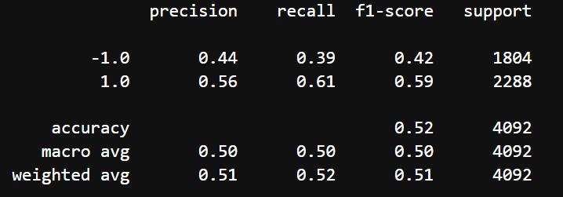

# CFB Module 14 Challenge: Algorithmic Trading Bot

The program in focus is a Python-based machine learning trading algorithm.  The analysis creates a trading bot using SVC and tests various parameters to identify impact on performance; there are images of classifciation reports and cumulative returns in the report.  The analysis also evaluates an alternative trading bot driven by Random Forest.  

---

## Technologies

The application is written in Python 3.7 in a Jupyter notebook with support from the following packages:  

*[Pandas] (https://github.com/pandas) - Data Analysis

*[SKLearn] (https://github.com/scikit-learn) - Advanced Data Anaylsis and Machine Learning: SVM / Classification Report / StandardScaler

*[Path] (https://github.com/path) - CSV File Reading

*[hvPlot] (https://github.com/hvplot) - Interactive Plotting tools

## Installation Guide

Install hvPlot through the command **conda install -c pyviz hvplot**

Install scikit-learn through command **pip install -U scikit-learn**

## Summary and Analysis

The baseline SVC model was run with different training periods and some updated paramaters.  The starting test period was 3 months with SMAs of 4 and 100.  With these starting paramters, the average precision was 0.49.  Strategy returns were stronger than the actual returns.

Starting Parameters:

With a 9 month training period, average precision went down to 0.45.  Strategy returns went down to average returns.

9m test period:

With an 18 month training period average precision went up to .66, and returns went back to outperforming.

18m test period:

Going back to a 3 month training period but with SMA windows of 30 and 150, average precision ended up at 0.55.  Howver, returns lost their outperformance.

30/150 SMA:

Overall, the best performance from the original SVC model was with a 18 month training period.

Random Forest was then employed to vary the classifier.  Average precision did not change but returns were better.  Random Forest was not as good as the SVC model with an 18 month training period.

Random Forest:

Evaluation Report Conclusion:
Within the SVC models, the version with the 18 month training period performed the best.  Random Forest classification did not seem to improve performance.  The best returns and performance were still with the 18m SVC.

## Contributors
Vishnu Kurella, vishnu.kurella@gmail.com

## License
VK.LQA 2021